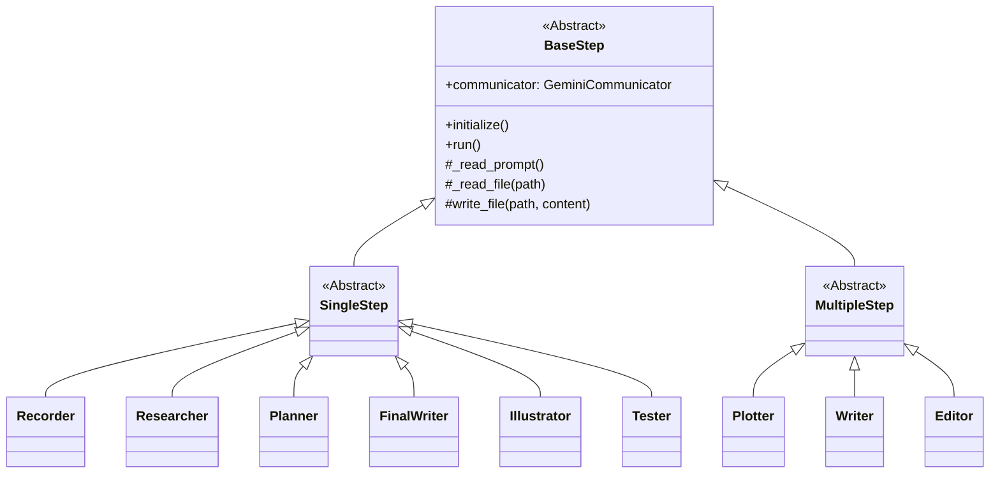
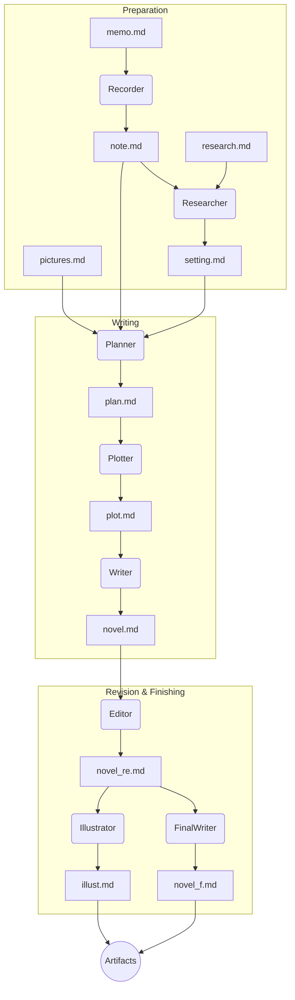

# Introduction to novel_workflow: An AI-Powered Novel Writing Support Tool

## Introduction

This document explains "novel_workflow," a command-line tool that semi-automates the novel writing process from brainstorming and writing to proofreading and even generating illustrations, all using AI.

## Overview

This tool divides the entire novel writing process into multiple "steps," each executed as an independent Python script. In each step, it collaborates with Google's generative AI model, "Gemini," to produce high-quality text. By editing the `config.yaml` file, users can flexibly customize the workflow's behavior.

## Key Features

- **Modular Workflow**: The writing process is divided into independent steps (classes), making maintenance and expansion easy.
- **Gemini API Integration**: Utilizes the powerful generative AI, Gemini, for text generation and brainstorming in each step.
- **Configuration File Control**: Centrally manages the model used, input/output file paths, and more through the `config.yaml` file.
- **External Prompt Management**: The prompts used in each step are separated into Markdown files, making them easy to improve and modify.

## Architecture

This tool consists of a `Director` class (in `directer.py`) that controls the overall flow, multiple `Step` classes that handle individual processes, and a `YamlAdapter` that reads the configuration file.

- **`Director`**: Determines which `Step` to execute based on `config.yaml` and command-line arguments, and calls the processes sequentially.
- **`BaseStep` (Abstract Class)**: The base class for all `Step` classes. It provides common functionalities such as communication with Gemini, file I/O, and prompt loading.
- **`SingleStep` and `MultipleStep` (Abstract Classes)**: Inherit from `BaseStep` and provide skeletons for steps that produce single or multiple output files.
- **`Step` (Concrete Classes)**: Specific implementations responsible for each stage of the workflow, such as `Planner` and `Writer`.
- **`GeminiCommunicator`**: Encapsulates communication with the Gemini API, sending prompts and receiving results.

### Class Diagram

`BaseStep` is defined as an abstract base class, and each concrete step class inherits from `SingleStep` or `MultipleStep`.



## Workflow Overview

The `Director` class executes each step in the following order. The output of the previous step becomes the input for the next.



### Role of Each Step

| Step | Class | Inherits from | Role |
|:---|:---|:---|:---|
| **Recorder** | `Recorder` | `SingleStep` | Formats handwritten notes (`memo.md`) and generates a digitized `note.md`. |
| **Researcher** | `Researcher` | `SingleStep` | Creates the story's background settings (`setting.md`) based on `note.md` and a research file (`research.md`). |
| **Planner** | `Planner` | `SingleStep` | Generates an overall story structure (`plan.md`) from `note.md`, `pictures`, and `setting.md`. |
| **Plotter** | `Plotter` | `MultipleStep` | Creates a more detailed plot (`plot.md`) based on `plan.md`. |
| **Writer** | `Writer` | `MultipleStep` | Writes the main text of the novel (`novel.md`) according to `plot.md`. |
| **Editor** | `Editor` | `MultipleStep` | Proofreads and revises `novel.md`, creating a revised version (`novel_re.md`). |
| **FinalWriter** | `FinalWriter` | `SingleStep` | Finishes the revised manuscript into a final draft (`novel_f.md`). |
| **Illustrator** | `Illustrator` | `SingleStep` | Generates ideas for illustrations (`illust.md`) based on the story's content. |
| **Tester** | `Tester` | `SingleStep` | A step for testing and debugging purposes. Not part of the main workflow. |

## How to Use

1.  **Configuration**: Set the necessary paths (API key, working directory, etc.) in `config.yaml`.
2.  **Prepare Input Files**: Create the input files required for the first step, such as `memo.md` and `research.md`.
3.  **Execution**: Run `main.py` from the command line. You can specify the step to run with the `--step` argument.

```bash
# Run only the Recorder step
python apps/main.py --step recorder

# Run all steps sequentially
python apps/main.py --step all
```

4.  **Check Output**: The results will be output into folders named after each step.

## Conclusion

`novel_workflow` is an experimental tool designed to accelerate creative writing activities with the power of AI. We aim to further refine the prompts for each step to achieve more autonomous and high-quality story generation in the future.