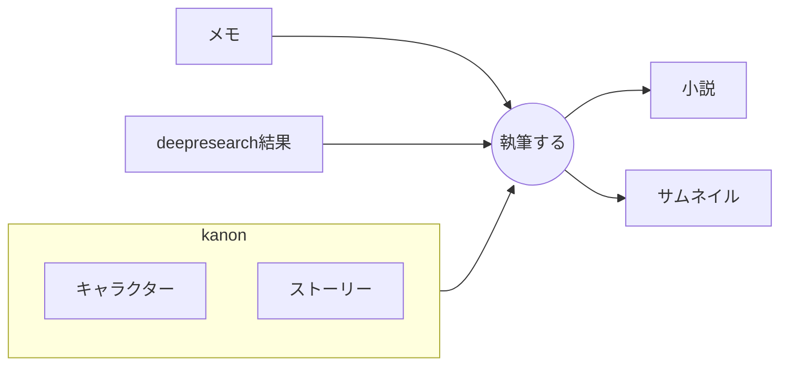
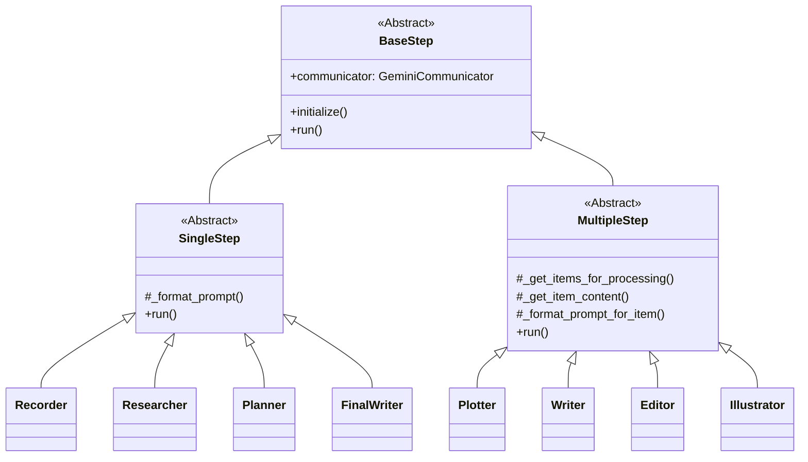
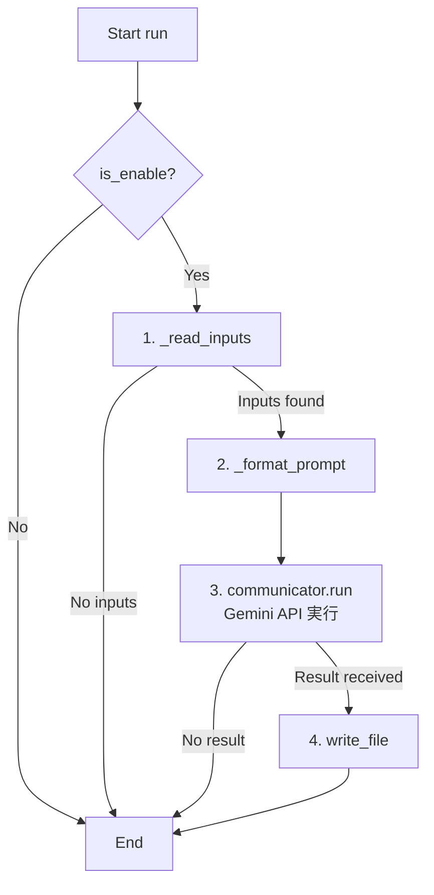
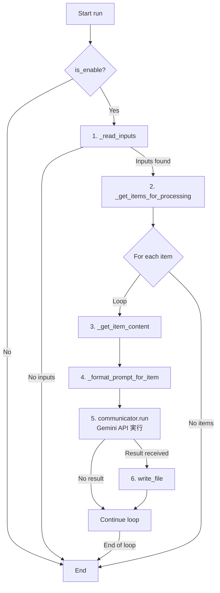
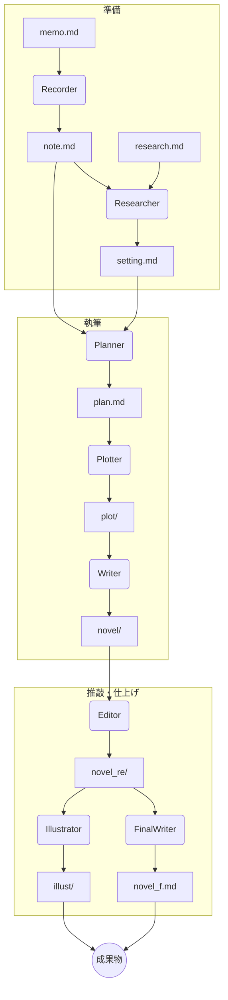

# AI小説執筆支援ツール novel_workflow のご紹介

## はじめに

このドキュメントでは、AIを活用して小説のアイデア創出から執筆、推敲、さらにはイラスト生成までを半自動で行うコマンドラインツール「novel_workflow」について解説します。

## 概要


基幹となるkanon(作って欲しい小説内容)の内容をベースとしてメモとdeepresearch結果から小説を自動生成するためのツールです。
AIに上記プロセスを実行させようとした結果、途中で介入しないとどうしようもないという結論に達したので、仕方なく中間生成物を大量に吐き出させるという構造になっています。

## 主な特徴

- **モジュール化されたワークフロー**: 執筆プロセスが独立したステップ（クラス）に分かれており、保守と拡張が容易です。
- **Gemini API 連携**: 各ステップでの文章生成やアイデア出しに、強力な生成AIであるGeminiを活用します。
- **設定ファイルによる制御**: `config.yaml`ファイルで、使用するモデルや入出力ファイルパスなどを一元管理できます。
- **プロンプトの外部管理**: 各ステップで使用するプロンプトがMarkdownファイルとして分離されており、改善や変更が容易です。

## アーキテクチャ
### 上位アーキテクチャ

```mermaid
architecture-beta
    group gemini(cloud)[Gemini]
    group pc(logos:aws-ec2)[Local PC]
    service gemini_api(logos:aws-elastic-beanstalk)[API] in gemini
    service novel_workflow(logos:aws-step-functions)[CLI] in pc
    service database(database)[Folder] in pc
    gemini_api :B -- T: novel_workflow
    novel_workflow : L -- R: database

    
    
```



### 下位アーキテクチャ


本ツールは、全体の流れを制御する`Director`、各処理の共通機能を定義する`BaseStep`、具体的な実行ロジックを持つ`SingleStep`と`MultipleStep`、そして個別の処理を担当する具象`Step`クラス群から構成されています。

- **`Director`**: `config.yaml`とコマンドライン引数に基づき、実行すべき`Step`を判断し、順次処理を呼び出します。
- **`BaseStep` (抽象クラス)**: 全ての`Step`クラスの基底クラス。Geminiとの通信、ファイルI/O、プロンプト読み込みなどの共通機能を提供します。
- **`SingleStep` / `MultipleStep` (抽象クラス)**: `BaseStep`を継承し、それぞれ単一出力、複数出力のステップの実行ロジックを実装します。
- **`Step` (具象クラス)**: `Planner`, `Writer`など、ワークフローの各工程を担当する具体的な実装。`SingleStep`または`MultipleStep`を継承します。
- **`GeminiCommunicator`**: Gemini APIとの通信をカプセル化し、プロンプトを送信して結果を受け取ります。

### クラス構成図

`BaseStep`を頂点とし、`SingleStep`と`MultipleStep`が派生します。各具象ステップクラスは、その特性に応じていずれかを継承します。



### 基本動作フロー

#### SingleStepの動作フロー

単一の出力を生成するステップ（例: `Recorder`, `Planner`）の動作フローです。



#### MultipleStepの動作フロー

複数の入力から複数の出力を生成するステップ（例: `Plotter`, `Writer`）の動作フローです。内部でループ処理が実行されます。



## ワークフローの全体像

`Director`クラスは、以下の順序で各ステップを実行します。前のステップの出力が、次のステップの入力となります。



### 各ステップの役割

| ステップ | クラス | 継承元 | 役割 |
|:---|:---|:---|:---|
| **Recorder** | `Recorder` | `SingleStep` | 手書きのメモ(`memo.md`)を整形し、デジタル化された`note.md`を生成します。 |
| **Researcher** | `Researcher` | `SingleStep` | `note.md`と調査ファイル(`research.md`)を基に、物語の背景設定(`setting.md`)を作成します。 |
| **Planner** | `Planner` | `SingleStep` | `note.md`と`setting.md`から、物語全体の構成案(`plan.md`)を生成します。 |
| **Plotter** | `Plotter` | `MultipleStep` | `plan.md`を基に、より詳細なプロットを複数ファイルとして生成します。 |
| **Writer** | `Writer` | `MultipleStep` | 分割されたプロットファイル群を基に、それぞれ対応する本文を執筆します。 |
| **Editor** | `Editor` | `MultipleStep` | 生成された本文ファイル群をそれぞれ校正・推敲します。 |
| **FinalWriter** | `FinalWriter` | `SingleStep` | 分割された推敲済みファイル群を結合し、一つの完成稿として出力します。 |
| **Illustrator** | `Illustrator` | `MultipleStep` | 推敲済みの本文ファイル群を基に、それぞれ対応する挿絵案を生成します。 |

## 使い方

1.  **設定**: `config.yaml`に必要なパス（APIキー、作業ディレクトリなど）を設定します。
2.  **入力ファイルの準備**: `memo.md`や`research.md`など、最初のステップに必要な入力ファイルを作成します。
3.  **実行**: コマンドラインから`main.py`を実行します。`--step`引数で実行したいステップを指定できます。

```bash
# Recorderステップのみ実行
python apps/main.py --step recorder

# 全てのステップを順次実行
python apps/main.py --step all
```

4.  **確認**: 各ステップの名称で作成されたフォルダ内に、成果物が出力されます。
