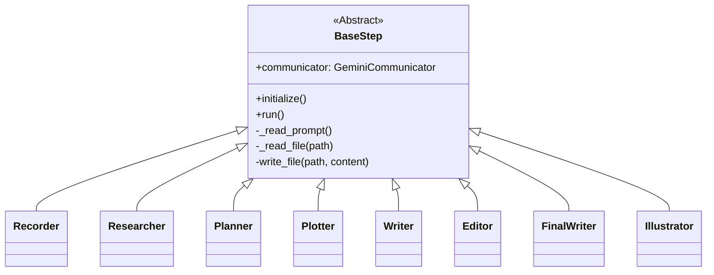
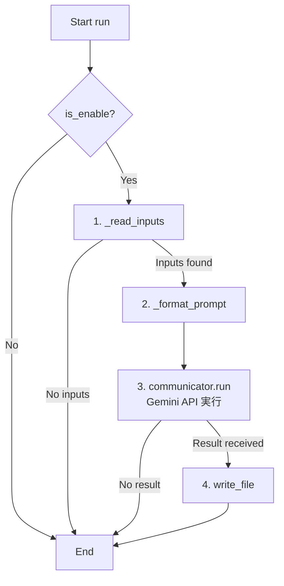
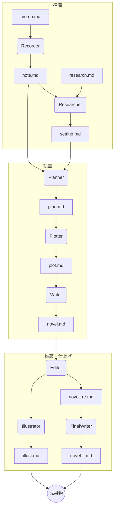

# AI小説執筆支援ツール novel_workflow のご紹介

## はじめに

このドキュメントでは、AIを活用して小説のアイデア創出から執筆、推敲、さらにはイラスト生成までを半自動で行うコマンドラインツール「novel_workflow」について解説します。

## 概要

本ツールは、一連の小説執筆プロセスを複数の「ステップ」に分割し、それぞれを独立したPythonスクリプトとして実行します。各ステップでは、Googleの生成AIモデル「Gemini」と連携し、高品質なテキスト生成を行います。設定ファイル`config.yaml`を編集することで、ユーザーはワークフローの挙動を柔軟にカスタマイズできます。

## 主な特徴

- **モジュール化されたワークフロー**: 執筆プロセスが独立したステップ（クラス）に分かれており、保守と拡張が容易です。
- **Gemini API 連携**: 各ステップでの文章生成やアイデア出しに、強力な生成AIであるGeminiを活用します。
- **設定ファイルによる制御**: `config.yaml`ファイルで、使用するモデルや入出力ファイルパスなどを一元管理できます。
- **プロンプトの外部管理**: 各ステップで使用するプロンプトがMarkdownファイルとして分離されており、改善や変更が容易です。

## アーキテクチャ

本ツールは、全体の流れを制御する`Director`と、個別の処理を担当する複数の`Step`クラス、そして設定ファイルを読み込む`YamlAdapter`から構成されています。

- **`Director`**: `config.yaml`とコマンドライン引数に基づき、実行すべき`Step`を判断し、順次処理を呼び出します。
- **`BaseStep` (抽象クラス)**: 全ての`Step`クラスの基底クラス。Geminiとの通信、ファイルI/O、プロンプト読み込みなどの共通機能を提供します。
- **`Step` (具象クラス)**: `Planner`, `Writer`など、ワークフローの各工程を担当する具体的な実装です。
- **`GeminiCommunicator`**: Gemini APIとの通信をカプセル化し、プロンプトを送信して結果を受け取ります。

### クラス構成図

`BaseStep`は抽象基底クラスとして定義されており、各具象ステップクラス（`Recorder`、`Planner`など）はこれを継承して実装されています。



### 基本動作フロー

各ステップの基本的な実行ロジックは`BaseStep`の`run`メソッドに定義されています。単一の出力を生成するステップ（例: `Recorder`, `FinalWriter`）は、以下のフローで動作します。



| メソッド | 役割 |
|:---|:---|
| `_read_inputs()` | (抽象メソッド) 具象クラスで実装。プロンプトの組み立てに必要な入力ファイル等を読み込み、辞書形式で返します。 |
| `_format_prompt()` | (抽象メソッド) 具象クラスで実装。`_read_inputs`で得られたデータとプロンプトテンプレートを組み合わせ、最終的なプロンプト文字列を生成します。 |
| `communicator.run()` | `GeminiCommunicator`のメソッド。生成されたプロンプトをGemini APIに送信し、結果を待ち受けます。 |
| `write_file()` | `BaseStep`のメソッド。APIから得られた結果を指定されたパスに書き込みます。 |

なお、`Plotter`, `Writer`, `Editor`, `Illustrator`のように複数の入力を個別に処理するステップは、`run`メソッドの代わりに`_run_multiple_outputs`メソッドが呼び出され、上記のフローが内部でループ実行されます。

## ワークフローの全体像

`Director`クラスは、以下の順序で各ステップを実行します。前のステップの出力が、次のステップの入力となります。



### 各ステップの役割

| ステップ | クラス | 役割 |
|:---|:---|:---|
| **Recorder** | `Recorder` | 手書きのメモ(`memo.md`)を整形し、デジタル化された`note.md`を生成します。 |
| **Researcher** | `Researcher` | `note.md`と調査ファイル(`research.md`)を基に、物語の背景設定(`setting.md`)を作成します。 |
| **Planner** | `Planner` | `note.md`と`setting.md`から、物語全体の構成案(`plan.md`)を生成します。 |
| **Plotter** | `Plotter` | `plan.md`を基に、より詳細なプロットを作成します。<br>※内部的にプランを分割し、プロットを複数ファイルとして生成します。 |
| **Writer** | `Writer` | `plot.md`に従って、小説の本文を執筆します。<br>※分割されたプロットファイル群を基に、それぞれ対応する本文を執筆します。 |
| **Editor** | `Editor` | `novel.md`を校正・推敲し、修正版を作成します。<br>※生成された本文ファイル群をそれぞれ校正・推敲します。 |
| **FinalWriter** | `FinalWriter` | 推敲済みの原稿を最終的な完成稿に仕上げます。<br>※分割された推敲済みファイル群を結合し、一つのファイルとして出力します。 |
| **Illustrator** | `Illustrator` | 物語の内容に基づき、挿絵のアイデアを生成します。<br>※推敲済みの本文ファイル群を基に、それぞれ対応する挿絵案を生成します。 |

## 使い方

1.  **設定**: `config.yaml`に必要なパス（APIキー、作業ディレクトリなど）を設定します。
2.  **入力ファイルの準備**: `memo.md`や`research.md`など、最初のステップに必要な入力ファイルを作成します。
3.  **実行**: コマンドラインから`main.py`を実行します。`--step`引数で実行したいステップを指定できます。

```bash
# Recorderステップのみ実行
python apps/main.py --step recorder

# 全てのステップを順次実行
python apps/main.py --step all
```

4.  **確認**: 各ステップの名称で作成されたフォルダ内に、成果物が出力されます。


