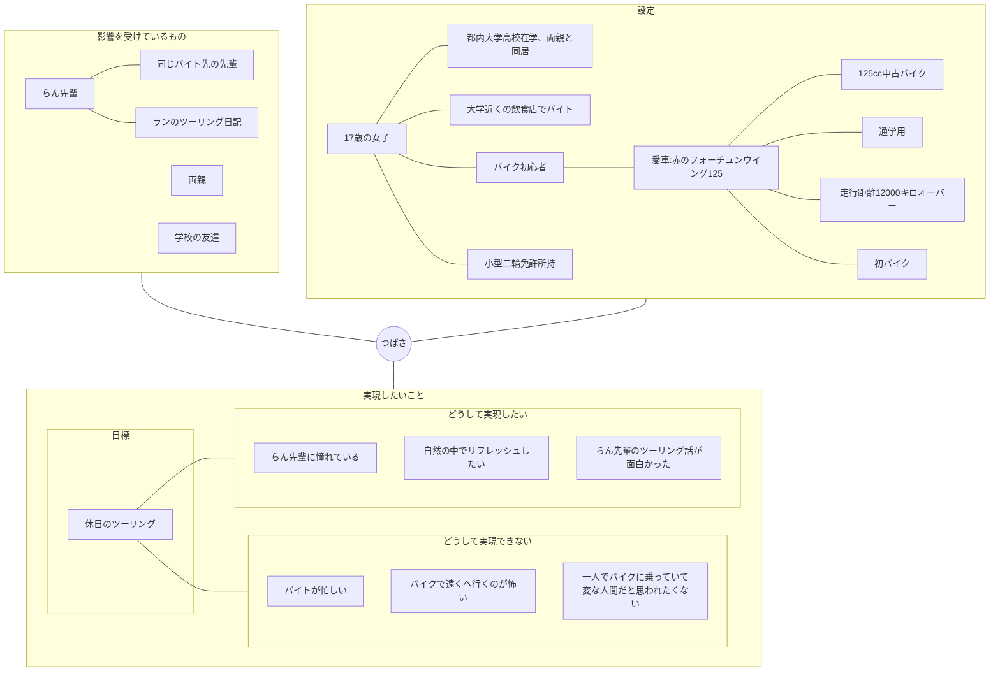
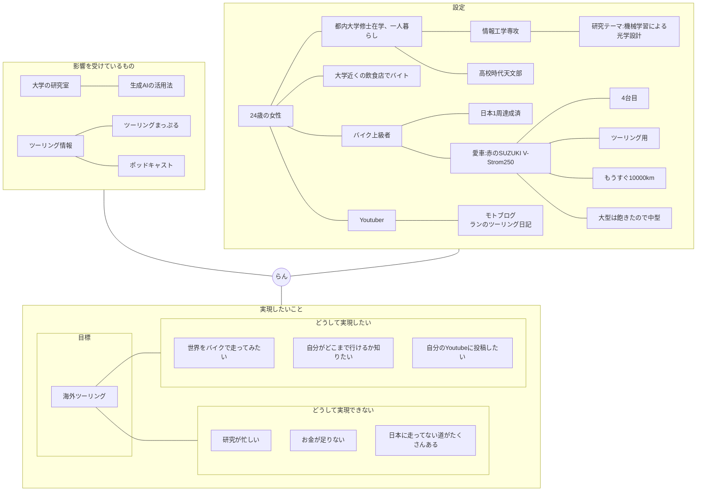

## つばさ

```mermaid
graph TD
    subgraph S_SETTING [設定]
        setting1[17歳の女子] --- setting2[都内大学高校在学、両親と同居]
        setting1 --- setting7[大学近くの飲食店でバイト]
        setting1 --- setting9[バイク初心者]
        setting1 --- setting10[小型二輪免許所持]
        setting9 --- setting3[愛車:赤のフォーチュンウイング125]
        setting3 --- setting4[125cc中古バイク]
        setting3 --- setting5[通学用]
        setting3 --- setting6[走行距離12000キロオーバー]
        setting3 --- setting8[初バイク]
    end

    subgraph S_INFLUENCE [影響を受けているもの]
        S_INF1[らん先輩] --- S_INF1_1[同じバイト先の先輩]
        S_INF1 --- S_INF1_2[ランのツーリング日記]
        S_INF2[両親] 
        S_INF3[学校の友達] 
    end
    
    subgraph Lower [実現したいこと]
        subgraph sun_purpose[ 目標]

            D[休日のツーリング]
        end
        
        subgraph sub_cannot[どうして実現できない]
            cannot1[バイトが忙しい]
            cannot2[バイクで遠くへ行くのが怖い]
            cannot3[一人でバイクに乗っていて変な人間だと思われたくない]

        end
        subgraph sub_want[どうして実現したい]
            want1[らん先輩に憧れている]
            want2[自然の中でリフレッシュしたい]
            want3[らん先輩のツーリング話が面白かった]
        end
    end
    
    PEOPLE((つばさ))
    S_INFLUENCE --- PEOPLE
    S_SETTING --- PEOPLE
    PEOPLE --- Lower
    D --- sub_cannot
    D --- sub_want
```

## らん

```mermaid
graph TD
    subgraph S_SETTING [設定]
        setting1[24歳の女性] --- setting2[都内大学修士在学、一人暮らし]
        setting1 --- setting7[大学近くの飲食店でバイト]
        setting1 --- setting9[バイク上級者]
        setting9 --- setting14[日本1周達成済]
        setting1 --- setting12[Youtuber]
        setting2 --- setting10[情報工学専攻]
        setting10 --- setting16[研究テーマ:機械学習による光学設計]
        setting2 --- setting15[高校時代天文部]
        setting9 --- setting3[愛車:赤のSUZUKI V-Strom250]
        setting3 --- setting4[4台目]
        setting3 --- setting5[ツーリング用]
        setting3 --- setting6[もうすぐ10000km]
        setting3 --- setting8[大型は飽きたので中型]
        setting12 --- setting13[モトブログ<br>ランのツーリング日記]
        
    end

    subgraph S_INFLUENCE [影響を受けているもの]
        S_INF1[大学の研究室]
        S_INF1 --- S_INF1_1[生成AIの活用法]
        S_INF2[ツーリング情報] ---  S_INF2_1[ツーリングまっぷる]
        S_INF2 --- S_INF2_2[ポッドキャスト]
    end
    
    subgraph Lower [実現したいこと]
        subgraph sun_purpose[目標]

            D[海外ツーリング]
        end
        
        subgraph sub_cannot[どうして実現できない]
            cannot1[研究が忙しい]
            cannot2[お金が足りない]
            cannot3[日本に走ってない道がたくさんある]

        end
        subgraph sub_want[どうして実現したい]
            want1[世界をバイクで走ってみたい]
            want2[自分がどこまで行けるか知りたい]
            want3[自分のYoutubeに投稿したい]
        end
    end
    
    PEOPLE((らん))
    S_INFLUENCE --- PEOPLE
    S_SETTING --- PEOPLE
    PEOPLE --- Lower
    D --- sub_cannot
    D --- sub_want
```