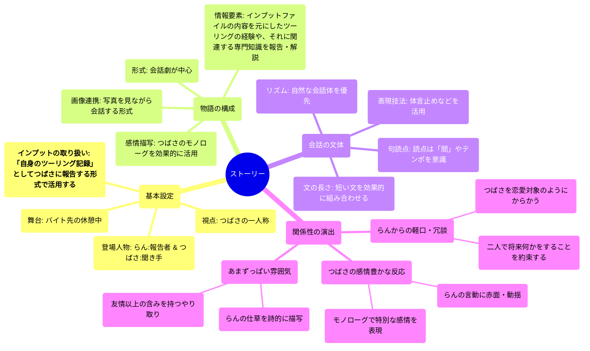

```mermaid
mindmap
  root((ストーリー))
    (基本設定)
      ::icon(fa fa-users)
      (登場人物: らん:報告者 & つばさ:聞き手)
      (舞台: バイト先の休憩中)
      (視点: つばさの一人称)
      (**インプットの取り扱い: 「自身のツーリング記録」としてつばさに報告する形式で活用する**)
    (物語の構成)
      ::icon(fa fa-sitemap)
      (形式: 会話劇が中心)
      (感情描写: つばさのモノローグを効果的に活用)
      (画像連携: 写真を見ながら会話する形式)
      (情報要素: インプットファイルの内容を元にしたツーリングの経験や、それに関連する専門知識を報告・解説)

    (会話の文体)
      ::icon(fa fa-pencil-alt)
      (リズム: 自然な会話体を優先)
      (句読点: 読点は「間」やテンポを意識)
      (文の長さ: 短い文を効果的に組み合わせる)
      (表現技法: 体言止めなどを活用)
    (関係性の演出)
      ::icon(fa fa-heart)
      (らんからの軽口・冗談)
        (つばさを恋愛対象のようにからかう)
        (二人で将来何かをすることを約束する)
      (つばさの感情豊かな反応)
        (らんの言動に赤面・動揺)
        (モノローグで特別な感情を表現)
      (あまずっぱい雰囲気)
        (らんの仕草を詩的に描写)
        (友情以上の含みを持つやり取り)
```